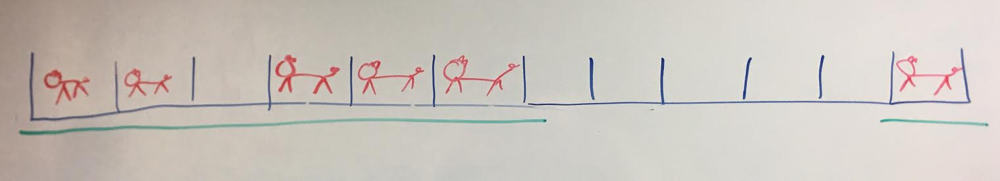

# Greedy Algorithms

If you want a refresher on today's lecture, check out the [accompanying slides](https://drive.google.com/open?id=18X5HTVq0JEDlH9v9b0_1yA1InlN3ZeRGChd8qEHJ2Gw). If you aren't sure how to validate that a greedy algorithm always produces the correct solution, check out this [PDF](https://drive.google.com/open?id=0B_K4P69ad_l_RG9vc0VZeDhyWUk) on the greedy exchange property. Finally, if you want to watch another lecture, the [MIT lecture](https://youtu.be/2P-yW7LQr08?t=17m28s) covered some of the material we did today in class. The proof begins around [42:39](https://youtu.be/2P-yW7LQr08?t=42m39s).

*Note: Not all of these problems can/should be solved using a Greedy appoach. It is up to you to determine which class of algorithm suites each problem*

## Barn Repair

Farmer Katie has a barn with stalls in which her cows live. All the stalls are the same width.

Unfortunately, after a nasty storm, Farmer Katie must quickly erect new boards in front of the stalls, since all the doors were lost. Her new lumber supplier will supply her boards of any length she wishes, but the supplier can only deliver a small number of total boards. Farmer Katie wishes to minimize the total length of the boards she must purchase i.e. minimize the total number of stalls she has to cover.

Given `int M`, the maximum number of boards that can be purchased; `int S`, the total number of stalls; `int C` (1 <= C <= S) the number of cows in the stalls, `int[] occupied` containing all the occupied stall numbers (1 <= stall_number <= S), calculate the **minimum number of stalls** that must be blocked in order to block all the stalls that have cows in them.

### Example

*Note: Farmer Katie refused to be photographed for this example problem. The
cows however, did not mind.*

Given `M = 2, N = 12, C = 6, occupied = {1, 2, 4, 5, 6, 12}`:

return 7: Katie has to cover stalls numbered 1-6, and 12.

Return the total number of stalls blocked.

## Mixing Milk

The Abrahams Merry Milk Makers company buys milk from farmers like Sidd, packages it into attractive 1- and 2-Unit bottles, and then sells that milk to grocery stores so we can each start our day with delicious cereal and milk.

Since milk packaging is such a difficult business in which to make money, it is important to keep the costs as low as possible. Help A-Triple-M purchase the farmers' milk in the cheapest possible manner. The AMMM company has an extraordinarily talented marketing department and knows precisely how much milk they need each day to package for their customers.

The company has contracts with several farmers from whom they may purchase milk, and each farmer has a (potentially) different price at which they sell milk to the packing plant. Of course, a herd of cows can only produce so much milk each day, so the farmers already know how much milk they will have available.

Each day, Abrahams Merry Milk Makers can purchase an integer number of units of milk from each farmer, a number that is always less than or equal to the farmer's limit (and might be the entire production from that farmer, none of the production, or any integer in between).

Your function accepts:

- `int M`: the Abrahams Merry Milk Makers' daily requirement of milk
- `int N`: the number of farmers AMMM can buy from
- `int[] units`: `units[i]` denotes how many units of milk farmer `i` has
- `int[] price`: `price[i]` denotes the cost of 1 unit of milk for farmer `i`

and calculates and returns the minimum amount of money that the Abrahams Merry Milk Makers must spend to meet their daily need for milk.

### Example

Given `M = 100, N = 5, units = {20, 40, 10, 80, 30}, price = {5, 9, 3, 8, 6}` (e.g. Farmer 0 says "I will sell 20 units at 5 cents per unit").

Solution:
Buy 20 units from Farmer 0, 10 units from Farmer 2, 40 units from Farmer 3, 30 units from Farmer 4: return total cost = 630. 

## First Version with Failure

Product Manager Siddharth has just switched teams at his company. He discovers to his dismay that his new team's product fails a quality check. The team has been using a version control system where they label versions in a consecutive fashion, `[1, 2, ... , n]`, and perform a quality check at each version. Because versions are developed one after another, if version `j` fails the check, version `j+1` must also fail the check, if it exists.

The team has an API `IsFailingVersion`, which will tell you if a given version number fails the quality check. Write a function to help PM Siddharth find the *first* failing version number. You can assume version numbering started at `1`, and that the newest version is labeled `n`.

*Hint: `n` may be quite large, and is represented by a `long`. The max value of an `int` is lower than that of a `long`.*

*Another hint: if you code up your solution and the test cases are taking too long to run, think about how you can optimize your code to improve its runtime.*

